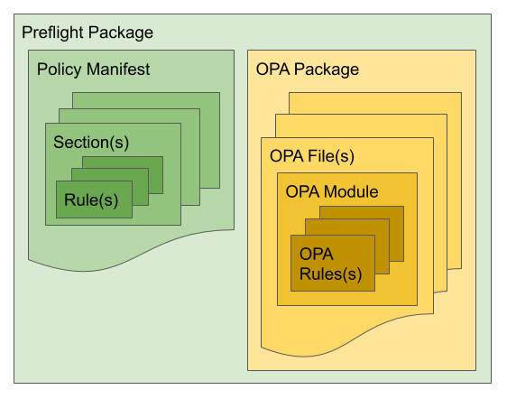

<p align="center">
<a href="https://prow.build-infra.jetstack.net/?job=post-preflight-release-canary">
<!-- prow build badge, godoc, and go report card-->

</a>
<a href="https://godoc.org/github.com/jetstack/preflight"></a>
<a href="https://goreportcard.com/report/github.com/jetstack/preflight"></a>
</p>

# Jetstack Preflight

Preflight is a tool to automatically perform Kubernetes cluster configuration
checks using [Open Policy Agent (OPA)](https://www.openpolicyagent.org/).

:warning: :construction:
**We're currently in the process of deprecating the**
**[Preflight _check_](#check) tool in favour of the**
**[Preflight _agent_](#agent).**
While this is happening the docs may be inconsistent and the repo structure may
change.
:warning: :construction:

<!-- markdown-toc start - Don't edit this section. Run M-x
markdown-toc-refresh-toc -->

**Table of Contents**

- [Jetstack Preflight](#jetstack-preflight)
	- [Background](#background)
	- [Agent](#agent)
	- [Check](#check)
	- [Packages](#packages)
	- [Get Preflight](#get-preflight)
		- [Download](#download)
		- [Build](#build)
	- [Use Preflight](#use-preflight)
		- [Use Preflight Locally](#use-preflight-locally)
		- [Use Preflight Web UI](#use-preflight-web-ui)
		- [Use Preflight In-Cluster](#use-preflight-in-cluster)

<!-- markdown-toc end -->

## Project Background

Preflight was originally designed to automate Jetstack's production readiness
assessments.
These are consulting sessions in which a Jetstack engineer inspects a customer's
cluster to suggest improvements and identify configuration issues.
The product of this assessment is a report
which describes any problems and offers remediation advice.

While these assessments have provided a lot of value to many customers, with a
complex system like Kubernetes it's hard to thoroughly check everything.
Automating the checks allows them to be more comprehensive and much faster.

The automation also allows the checks to be run repeatedly, meaning they can be
deployed in-cluster to provide continuous configuration checking. This enables
new interesting use cases as policy compliance audits.

## Components

This section outlines the approximate components of the tool and how they fit
together.

### Agent

The Preflight _agent_ uses _data gatherers_ to collect required data from
Kubernetes and cloud provider APIs before formatting it as JSON for analysis.
Once data has been collected, it is sent to the configured backend.

To run the Agent locally you can run:

```bash
preflight agent --agent-config-file ./path/to/agent/config/file.yaml
```

Or, to build and run a version from master:

```bash
go run main.go agent --agent-config-file ./path/to/agent/config/file.yaml
```

You can find the example agent file
[here](https://github.com/jetstack/preflight/blob/master/agent.yaml).

You might also want to run a local echo server to monitor requests the agent
sends:

```bash
go run main.go echo
```

### Check

The Preflight _check_ tool also uses _data gatherers_ to collect required data,
but unlike the _agent_ it evaluates this data and produces a report locally.

**This functionality is now deprecated in favour of the _agent_.** Previous
versions of the _check_ tool can still be downloaded and used, however it is no
longer being maintained and will be removed from this repository.

### Packages

Policies for cluster configuration are encoded into *Preflight packages*. You
can find some examples in [./preflight-packages](./preflight-packages).

Each package focuses on a different aspect of the cluster. For example, the
[`gke_basic`](preflight-packages/examples.jetstack.io/gke_basic) package
provides rules for the configuration of a GKE cluster, and the
[`pods`](preflight-packages/jetstack.io/pods) package provides rules for the
configuration of Kubernetes Pods.

A Preflight package consists of a *Policy Manifest* and a
[Rego](https://www.openpolicyagent.org/docs/latest/#rego) package.

The *Policy Manifest* is a YAML file that specifies a package's rules.
It gives descriptions of the rules and remediation advice,
so the tool can display useful information when a rule doesn't pass.

Rego is OPA's high-level declarative language for specifying rules. Rego rules
can be defined in multiples files grouped into logical Rego packages.

Anyone can create new Preflight packages to perform their own checks. The
Preflight docs include a guide on [how to write
packages](./docs/how_to_write_packages.md).



## Installation

This section outlines how to install Preflight.

### Agent

The following instructions walk through the installation of the Preflight agent
to gather data about cluster pods and send them to the backend for analysis.

**To complete the secret manifest below, you will need to have a Preflight
token.**

First create a namespace for the preflight components:

```yaml
apiVersion: v1
kind: Namespace
metadata:
  name: preflight
```

Next create a secret like the following, substituting your token:

```yaml
apiVersion: v1
kind: Secret
metadata:
  name: agent-config
  namespace: preflight
type: Opaque
stringData:
  config.yaml: |
    schedule: "* * * * *"
    token: # enter your token here
    endpoint:
      protocol: https
      host: preflight.jetstack.io
      path: /api/v1/datareadings
    data-gatherers:
    - name: "pods"
      kind: "k8s"
      config:
        resource-type:
          resource: pods
          version: v1
```

Now create a service account with permissions to read cluster resources:

```yaml
apiVersion: v1
kind: ServiceAccount
metadata:
  name: agent
  namespace: preflight
---
apiVersion: rbac.authorization.k8s.io/v1
kind: ClusterRoleBinding
metadata:
  name: preflight-agent-cluster-viewer
roleRef:
  apiGroup: rbac.authorization.k8s.io
  kind: ClusterRole
  # will be able to view all resources, but not rbac and secrets
  name: view
subjects:
- kind: ServiceAccount
  name: agent
  namespace: preflight
```

Finally deploy the agent:

```yaml
apiVersion: apps/v1
kind: Deployment
metadata:
  name: agent
  namespace: preflight
spec:
  replicas: 1
  selector:
    matchLabels:
      app.kubernetes.io/name: agent
  template:
    metadata:
      labels:
        app.kubernetes.io/name: agent
    spec:
      serviceAccountName: agent
      volumes:
      - name: config
        secret:
          secretName: agent-config
      containers:
      - name: agent
        image: quay.io/jetstack/preflight:7d4fa467258b7592d68fd660f1fd1d42e7332231
        args:
        - "agent"
        - "-c"
        - "/etc/secrets/preflight/agent/config.yaml"
        volumeMounts:
        - name: config
          mountPath: "/etc/secrets/preflight/agent"
          readOnly: true
        resources:
          requests:
            memory: "200Mi"
            cpu: "200m"
          limits:
            memory: "200Mi"
            cpu: "200m"
```

### Preflight V1 (check)

**This section is deprecated with the introduction of the agent**

#### Download

Preflight binaries and *bundles*, which include a binary and all the *packages*
in this repo, can be downloaded from the [releases
page](https://github.com/jetstack/preflight/releases).

#### Build

You can compile Preflight by running `make build`. It will create the binary in
`builds/preflight`.

### Use Preflight V1 (check)

Create your `preflight.yaml` configuration file. There is full [configuration
documentation](./docs/configuration.md) available, as well as several example
files in [`./examples`](./examples).

#### Use Preflight Locally

By default Preflight looks for a configuration at `./preflight.yaml`. Once this
is set up, run a Preflight check like so:

``` preflight check ```

You can try the Pods example
[`./examples/pods.preflight.yaml`](./examples/pods.preflight.yaml)
without having to change a line,
if your *kubeconfig* is located at `~/.kube/config` and
is pointing to a working cluster.

```
preflight check --config-file=./examples/pods.preflight.yaml
```

You will see a CLI formatted report if everything goes well. Also, you will get
a JSON report in `./output`.

#### Use Preflight Web UI

If you want to visualise the report in your browser, you can access the
[*Preflight Web UI*](https://preflight.jetstack.io/) and load the JSON report.
**This is a static website.** **Your report is not being uploaded to any
server.** **Everything happens in your browser.**

You can give it a try without even running the tool, since we provide some
report examples, [gke.json](./examples/reports/gke.json),
and[pods.json](./examples/reports/pods.json), ready to be loaded into the
[*Preflight Web UI*](https://preflight.jetstack.io/).

#### Use Preflight In-Cluster

Preflight can be installed in-cluster to run continuous checks. See the
[Installation Manual: Preflight
In-Cluster](./docs/installation_manual_in_cluster.md).
