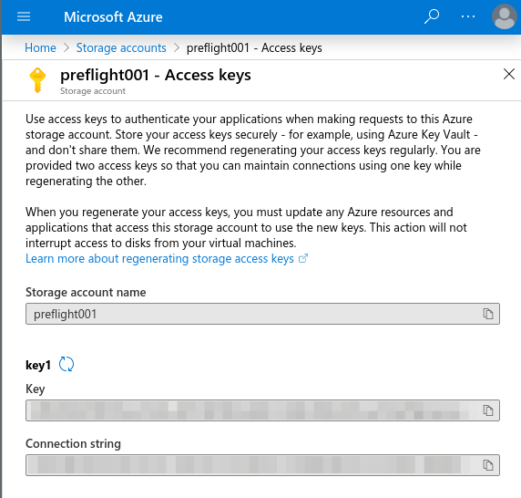

# Preflight Check

:warning: :construction:
**This page is about the deprecated check command**
:warning: :construction:

The Preflight _check_ tool also uses _data gatherers_ to collect required data,
but unlike the _agent_ it evaluates this data and produces a report locally.

**This functionality is now deprecated in favour of the _agent_.** Previous
versions of the _check_ tool can still be downloaded and used, however it is no
longer being maintained and will be removed from this repository.

## Packages

Policies for cluster configuration are encoded into *Preflight packages*. You
can find some examples in [./preflight-packages](./preflight-packages).

Each package focuses on a different aspect of the cluster. For example, the
[`gke_basic`](preflight-packages/examples.jetstack.io/gke_basic) package
provides rules for the configuration of a GKE cluster, and the
[`pods`](preflight-packages/jetstack.io/pods) package provides rules for the
configuration of Kubernetes Pods.

A Preflight package consists of a *Policy Manifest* and a
[Rego](https://www.openpolicyagent.org/docs/latest/#rego) package.

The *Policy Manifest* is a YAML file that specifies a package's rules.
It gives descriptions of the rules and remediation advice,
so the tool can display useful information when a rule doesn't pass.

Rego is OPA's high-level declarative language for specifying rules. Rego rules
can be defined in multiples files grouped into logical Rego packages.

Anyone can create new Preflight packages to perform their own checks. The
Preflight docs include a guide on [how to write
packages](./docs/how_to_write_packages.md).


## Installation

### Download

Preflight binaries and *bundles*, which include a binary and all the *packages*
in this repo, can be downloaded from the [releases
page](https://github.com/jetstack/preflight/releases).

### Build

You can compile Preflight by running `make build`. It will create the binary in
`builds/preflight`.

## Using Preflight

Create your `preflight.yaml` configuration file. There is full [configuration
documentation](./docs/configuration.md) available, as well as several example
files in [`./examples`](./examples).

### Locally

By default Preflight looks for a configuration at `./preflight.yaml`. Once this
is set up, run a Preflight check like so:

``` preflight check ```

You can try the Pods example
[`./examples/pods.preflight.yaml`](./examples/pods.preflight.yaml)
without having to change a line,
if your *kubeconfig* is located at `~/.kube/config` and
is pointing to a working cluster.

```
preflight check --config-file=./examples/pods.preflight.yaml
```

You will see a CLI formatted report if everything goes well. Also, you will get
a JSON report in `./output`.

### Web UI

If you want to visualise the report in your browser, you can access the
[*Preflight Web UI*](https://preflight.jetstack.io/) and load the JSON report.
**This is a static website.** **Your report is not being uploaded to any
server.** **Everything happens in your browser.**

You can give it a try without even running the tool, since we provide some
report examples, [gke.json](./examples/reports/gke.json),
and[pods.json](./examples/reports/pods.json), ready to be loaded into the
[*Preflight Web UI*](https://preflight.jetstack.io/).

### In-Cluster

This doc explains how to run Preflight inside a GKE cluster, and get periodic reports in a Google Cloud Storage Bucket.

#### Prerequisites

- A Google Cloud Platform project where to create the destination Google Cloud Storage Bucket.
- A GKE cluster with Workload Identity enabled to run Preflight (it can be a GKE cluster inside the previous project, for instance).
- `kubectl` 1.14+

We will apply Terraform modules as part of this guide, so Terraform should also be installed. However, if required, these operations can be completed in the GCP console or using `gcloud` instead.

#### A Preflight Docker image that includes your Preflight Packages.

For this example, we are going to use the generic image, `quay.io/jetstack/preflight`. It includes the packages from this repository ([preflight-packages](../preflight-packages)).

In case you want to add your own packages, you can create your own Docker image including those:

- Add your packages to the `preflight-packages` directory.
- Execute:
```
export DOCKER_IMAGE='myrepo/myimage'
make build-docker-image
make push-docker-image
```

#### Prepare GCP

##### Create a bucket where to store the reports and a service account that can write to that bucket

Now we need to create a bucket where to store the reports. We are using `preflight-results` as the name for the bucket here, but you will need to choose a different name.

Execute
```
cd ./deployment/terraform/results-bucket
terraform init
terraform apply
```

It will ask for a name for the bucket and for the ID of the Google Cloud project where the bucket is going to be created.

If it is executed correctly, it will generate the file `deployment/kubernetes/overlay/scanner/secrets/credentials.json` with the key for the writer service account.

##### Create another service account that Preflight will use to reach the Google Cloud API (only if we are going to use the `gke` datagatherer)

When Preflight runs inside a GKE cluster, the [`gke` datagatherer](./datagatherers/gke.md) can use [_Workload Identity_ and _Cross-Cluster Identity_](https://cloud.google.com/kubernetes-engine/docs/how-to/workload-identity) to authenticate against the Google Cloud API.

This consists of "linking" a Kubernetes service account (KSA) and a Google Cloud service account (GSA) so when a pod uses that KSA it can reach the Google Cloud API authenticated as the GSA.

The following terraform module creates a GSA with the enough permissions to be used with the `gke` datagatherer and also enables _Workload Identity_ on it.

**Create the service account**

Execute:
```
cd ./deployment/terraform/gke-datagatherer
terraform init
terraform apply
```

It will ask for the Google Cloud project ID where the cluster Preflight is going to check is running.

As a result of applying that, it creates a GSA named `preflight-scanner@[project-id].iam.gserviceaccount.com`.

#### Deploy Preflight

**Configure Google Cloud service account**

First, we need to annotate the KSA so it points to the GSA where we have configured _Workload Identity_. Edit `deployment/kubernetes/overlays/scanner/workload-identity.yaml` and make sure you change the annotation `iam.gke.io/gcp-service-account` so it is the GSA we have created in the previous step (`preflight-scanner@[project-id].iam.gserviceaccount.com`).

**Custom Docker Image (optional)**

If you built your own Docker image for Preflight, you need to edit `deployment/kubernetes/overlays/scanner/image.yaml` and change `image` there.

**Preflight configuration**

We also need to customize some things in the configuration file. Edit `deployment/kubernetes/overlays/scanner/config/preflight.yaml` and change:
- `cluster-name`, this is the name of the cluster in the context of Preflight. Will be used in the generated reports.
- `data-gatherers.gke`, make sure `project`, `location` and `cluster` correspond to the GKE cluster you want Preflight to scan.
- `outputs[_].bucket-name`, change it so it points to the bucket you created before.

**Deploy**

Now, you can execute `kubectl apply -k deployment/kubernetes/overlays/scanner` and it will deploy Preflight.

By default it runs every 30 minutes (you can change that by editing `deployment/kubernetes/overlays/scanner/period.yaml`). If you want to trigger an execution now, run `kubectl create job -n=preflight-scanner --from=cronjob/preflight preflight-job`.

#### Results

If Preflight runs correctly, some results will appear in the bucket, ordered by cluster name and timestamp: `<cluster-name>/<timestamp>/<package-name>.json`
# Installation Manual: Preflight In-Cluster

This doc explains how to run Preflight inside a GKE cluster, and get periodic reports in a Google Cloud Storage Bucket.

#### Prerequisites

- A Google Cloud Platform project where to create the destination Google Cloud Storage Bucket.
- A GKE cluster with Workload Identity enabled to run Preflight (it can be a GKE cluster inside the previous project, for instance).
- `kubectl` 1.14+

We will apply Terraform modules as part of this guide, so Terraform should also be installed. However, if required, these operations can be completed in the GCP console or using `gcloud` instead.

#### A Preflight Docker image that includes your Preflight Packages.

For this example, we are going to use the generic image, `quay.io/jetstack/preflight`. It includes the packages from this repository ([preflight-packages](../preflight-packages)).

In case you want to add your own packages, you can create your own Docker image including those:

- Add your packages to the `preflight-packages` directory.
- Execute:
```
export DOCKER_IMAGE='myrepo/myimage'
make build-docker-image
make push-docker-image
```

#### Prepare GCP

##### Create a bucket where to store the reports and a service account that can write to that bucket

Now we need to create a bucket where to store the reports. We are using `preflight-results` as the name for the bucket here, but you will need to choose a different name.

Execute
```
cd ./deployment/terraform/results-bucket
terraform init
terraform apply
```

It will ask for a name for the bucket and for the ID of the Google Cloud project where the bucket is going to be created.

If it is executed correctly, it will generate the file `deployment/kubernetes/overlay/scanner/secrets/credentials.json` with the key for the writer service account.

##### Create another service account that Preflight will use to reach the Google Cloud API (only if we are going to use the `gke` datagatherer)

When Preflight runs inside a GKE cluster, the [`gke` datagatherer](./datagatherers/gke.md) can use [_Workload Identity_ and _Cross-Cluster Identity_](https://cloud.google.com/kubernetes-engine/docs/how-to/workload-identity) to authenticate against the Google Cloud API.

This consists of "linking" a Kubernetes service account (KSA) and a Google Cloud service account (GSA) so when a pod uses that KSA it can reach the Google Cloud API authenticated as the GSA.

The following terraform module creates a GSA with the enough permissions to be used with the `gke` datagatherer and also enables _Workload Identity_ on it.

**Create the service account**

Execute:
```
cd ./deployment/terraform/gke-datagatherer
terraform init
terraform apply
```

It will ask for the Google Cloud project ID where the cluster Preflight is going to check is running.

As a result of applying that, it creates a GSA named `preflight-scanner@[project-id].iam.gserviceaccount.com`.

#### Deploy Preflight

**Configure Google Cloud service account**

First, we need to annotate the KSA so it points to the GSA where we have configured _Workload Identity_. Edit `deployment/kubernetes/overlays/scanner/workload-identity.yaml` and make sure you change the annotation `iam.gke.io/gcp-service-account` so it is the GSA we have created in the previous step (`preflight-scanner@[project-id].iam.gserviceaccount.com`).

**Custom Docker Image (optional)**

If you built your own Docker image for Preflight, you need to edit `deployment/kubernetes/overlays/scanner/image.yaml` and change `image` there.

**Preflight configuration**

We also need to customize some things in the configuration file. Edit `deployment/kubernetes/overlays/scanner/config/preflight.yaml` and change:
- `cluster-name`, this is the name of the cluster in the context of Preflight. Will be used in the generated reports.
- `data-gatherers.gke`, make sure `project`, `location` and `cluster` correspond to the GKE cluster you want Preflight to scan.
- `outputs[_].bucket-name`, change it so it points to the bucket you created before.

**Deploy**

Now, you can execute `kubectl apply -k deployment/kubernetes/overlays/scanner` and it will deploy Preflight.

By default it runs every 30 minutes (you can change that by editing `deployment/kubernetes/overlays/scanner/period.yaml`). If you want to trigger an execution now, run `kubectl create job -n=preflight-scanner --from=cronjob/preflight preflight-job`.

#### Results

If Preflight runs correctly, some results will appear in the bucket, ordered by cluster name and timestamp: `<cluster-name>/<timestamp>/<package-name>.json`


## Configuration

Configuration is provided to the Preflight application using a YAML file.
This specifies what packages to use, how data gatherers are configured,
and what outputs to produce.

Several example configuration files can be found in [`examples`](./examples).

### Cluster Name

The `cluster-name` field is used as the 'directory' prefix for output.
The value shouldn't contain spaces or `/`.
For example:

```
cluster-name: my-cluster
```

### Data Gatherers

Data gatherers are specified under the `data-gatherers` field.
For example:

```
data-gatherers:
  gke:
    project: my-gcp-project
    location: us-central1-a
    cluster: my-cluster
    credentials: /tmp/credentials.json
  k8s/pods:
    kubeconfig: ~/.kube/config
```

Each data gatherer has it's own configuration requirements,
which are documented separately.

The following data gatherers are available:

- [Kubernetes Pods](docs/datagatherers/k8s_pods.md)
- [Google Kubernetes Engine](docs/datagatherers/gke.md)
- [Amazon Elastic Kubernetes Service](docs/datagatherers/eks.md)
- [Microsoft Azure Kubernetes Service](docs/datagatherers/aks.md)
- [Local](docs/datagatheres/local.md)

### Package Sources

The `package-sources` field is a list of locations
which Preflight should load packages from.
For example:

```
package-sources:
- type: local
  dir: ./preflight-packages/
- type: local
  dir: /home/user/other-preflight-packages
```

Each source must a `type`, though currently the only valid type is `local`.
Local sources must then specify a directory
for Preflight to look for packages in using the `dir` field.
Preflight will search for packages in this directory recursively.

In future other source types may be added,
for example to load packages in GCS buckets.

### Enabled Packages

The `enabled-packages` field is a list of packages that Preflight should use.
For example:

```
enabled-packages:
  - "examples.jetstack.io/gke_basic"
  - "jetstack.io/pods"
```

This allows `package-sources` to be large collections of packages,
only some of which will be run depending on user configuration.

### Outputs

The `outputs` field is a list of output formats and locations that Preflight
will write data to. Multiple outputs can be specified,
each with their own settings.

```
outputs:
- type: local
  path: ./output
  format: json
- type: local
  path: ./output
  format: intermediate
- type: cli
```

There are different ways to output the results.
The `type` property indicates support of platform where results are going to be written.

Most types also require a `format` to be specified.
Possible formats are:
- `json` for raw JSON output.
- `markdown` for a markdown formatted report.
- `html` for a HTML formatted report.
- `intermediate` to output the raw JSON fetched by the *data gatherers*.

The reports in `markdown`, `html` and `cli` format make use of the
*policy manifest* to produce a human readable report describing
 which checks passed and which failed.
The `json` format is raw output from OPA evaluation.

If no `outputs` are specified Preflight will output a report
of the results to the CLI.

#### cli

With the `cli` type output the format is optional
and defaults to the `cli` format, for a coloured CLI formatted report.

#### local

The `local` type output writes the results to a local directory.
The directory must be specified with the `path` property.
It will be created in case it does not exist.

```
- type: local
  format: json
  path: ./output
```

#### gcs

The `gcs` type output uploads the results to a Google Cloud Storage bucket.

The property `bucket-name` indicates the ID of the GCS bucket where the results are going to be uploaded.
Preflight assumes the bucket already exists.

`credentials-path` is the path to the credentials that can be used to write to that bucket.
It is recommended to create a JSON key for a dedicated service account.

```
- type: gcs
  format: json
  bucket-name: myresultsbucket
  credentials-path: ./credentials.json
```

#### azblob

The `azblob` output uploads the results to an Azure Blob Storage container.

The `container` property indicated the ID of the container where to upload the results.
Preflight assumes the container already exists.

```
- type: azblob
  format: json
  container: myresultscontainer
```

Authentication is done by setting the environment variables `AZURE_STORAGE_ACCOUNT` and `AZURE_STORAGE_ACCESS_KEY`. You can create keys for a storage account from the Azure portal:


