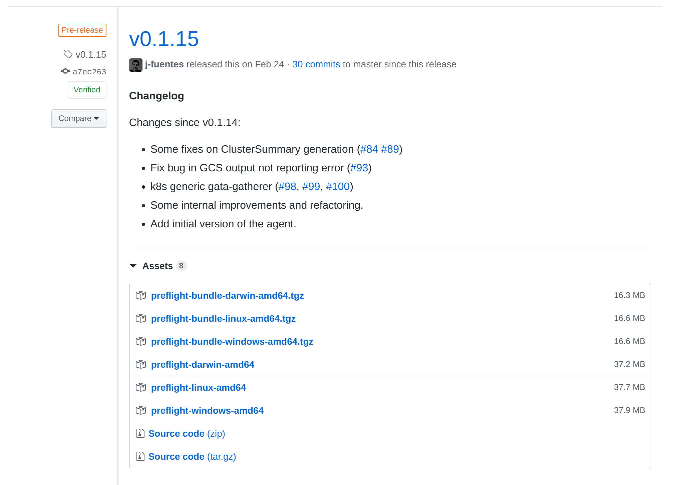
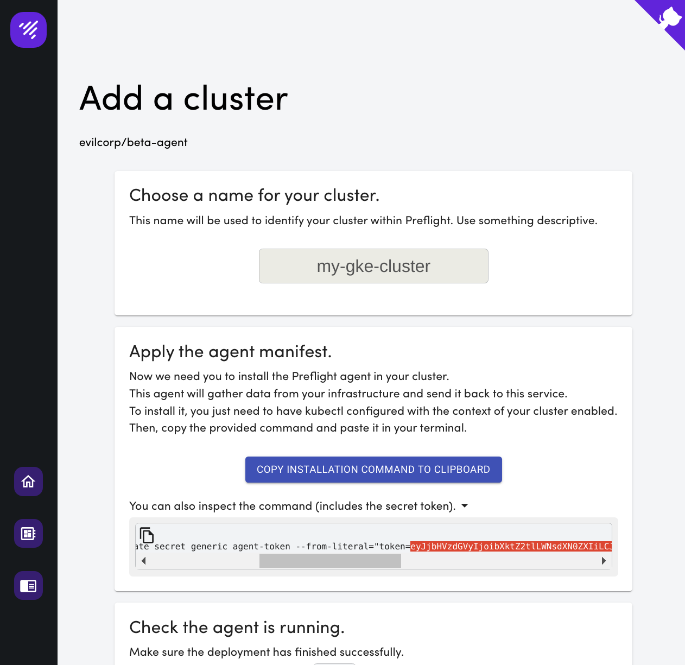
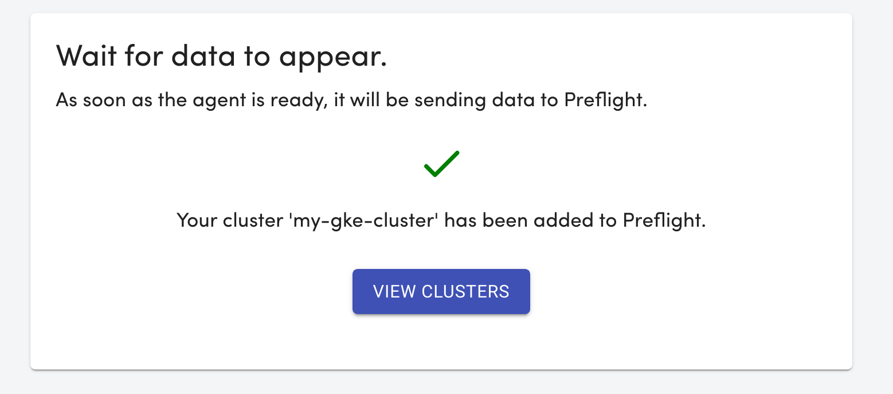
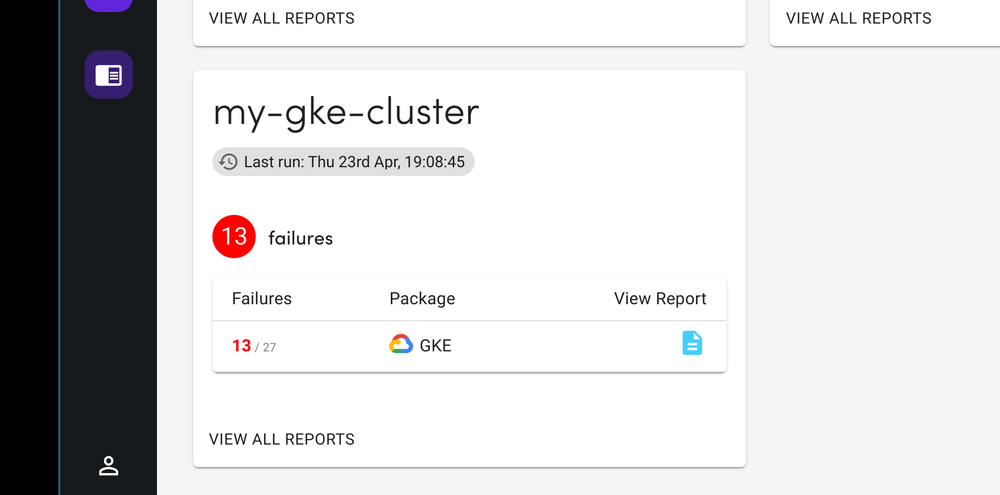

# How to run Preflight with the GKE package

This doc guides you on how to run preflight-agent locally to scan a GKE installation.

As a result, you will get a new cluster in your Preflight account showing reports with the GKE package.

It executes the agent locally because this guide is intented to be an interative demonstration, but the agent could be installed in-cluster as well. Take a look at the [GKE data-gatherer manual](../../datagatherers/gke.md) for further details on how to configure authentication in that scenario.

## Requisites

- A GKE cluster.
- The `gcloud` CLI tool working locally on your computer.
- `gcloud` is logged in to an account with permissions to read cluster and GKE state in the project where your cluster is running.
- You have already run `gcloud container clusters get-credentials [cluster] ...` to configure your kubeconfig.

## Get the preflight cli

Go to [the releases page](https://github.com/jetstack/preflight/releases) and download the binary of the latest stable release for your platform (`v0.1.15` at the moment of writing this).



For instance:

```
curl -L https://github.com/jetstack/preflight/releases/download/v0.1.15/preflight-linux-amd64 > preflight 
chmod +x ./preflight
```

Then run this to make sure you downloaded the right thing:

```
./preflight version
```

## Access Preflight

> At the moment, Preflight is in private beta. If you are interested, please [email us](mailto:preflight-maintainers@jetstack.io?subject=Preflight%20Beta%20Access) and we will grant to access to the beta program.

If you have an account, you will have an access token.

Enter [preflight.jetstack.io/login](https://preflight.jetstack.io/login) and access with your token.

You will be presented with the list of cluster in your organization.

## Add a new cluster and start agent

Click in "Add Cluster".

Choose a name for your cluster (e.g. `my-gke-cluster`) and click the accept button.

Then you will be presented with instructions to install the agent in a cluster.

Since you are going to run the agent locally instead of installing it in a cluster, you must copy the agent token and craft a config file manually.

You can extract the agent token from the installation command, as shown in the picture.



Then you can use this snipped as template for your configuration file and replace the agent token where it corresponds.

Also, change `cluster.project`, `cluster.location`, `cluster.name` accordingly so they point to your GKE cluster (`gcloud container clusters list` if you don't remember those values.).

If you don't specify `credentials`, it will try to use _Gcloud Application Default Credentials_. You can run `gcloud auth application-default login` to make sure your _Application Default Credentials_ are configured.

```yaml
# config.yaml

schedule: "* * * *"
token: "<add your agent token here>"
endpoint:
  protocol: https
  host: "preflight.jetstack.io"
  path: "/api/v1/datareadings"
data-gatherers:
- kind: "gke"
  name: "gke"
  config:
    cluster:
      project: my-gcp-project
      location: us-central1-a
      name: my-gke-cluster
      # Path to a file containing the credentials. If empty, it will try to use
      # the SDK defaults
      # credentials: /tmp/credentials.json
```

Save the file as `config.yaml`.

Now you can run the Preflight agent:

```
./preflight agent -c ./config.yaml
```

You should see in the log that it is sending data to the server periodically.

If you go back to the add cluster wizard and click "The agent it ready"



## See reports

If you go to the clusters view, you will see the new cluster is there:


